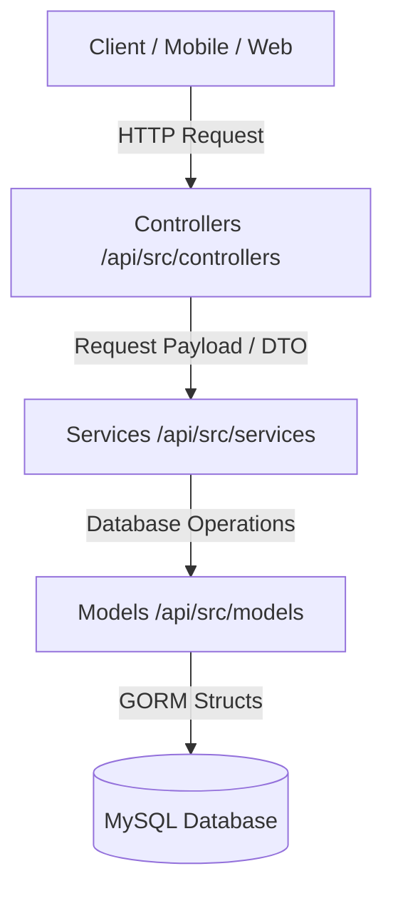

# Backend Development Skills & Best Practices (Go / Gin / GORM)

This guide documents the core skills, architectural conventions, coding patterns, and development practices for the **Klampis Depo** Go backend API (`kd-api`). Refer to this guide to eliminate trial-and-error, maintain codebase consistency, and prevent regressions.

---

## 1. Project Architecture

The backend follows a clean **Model-Service-Controller** architecture:



### Directory Breakdown

*   **`api/src/models/`**: Defines GORM structs mapped to database tables. Struct fields use PascalCase, and JSON serialized keys use camelCase.
*   **`api/src/services/`**: Implements core business logic. All database transactions and write operations are managed here.
*   **`api/src/controllers/`**: Coordinates HTTP request parsing, input validation, calls to services, and API response formatting.
*   **`api/src/dtos/`**: Input parameters, query filters, and customized response payload formats.
*   **`api/src/routes/`**: Handles endpoint registrations and registers middlewares.
*   **`api/src/middlewares/`**: Implements authentication (JWT), CORS policies, rate limiters, and role-based access control (RBAC).
*   **`api/src/config/`**: Sets up configuration constants, database connections, connection pooling parameters, and schema auto-migrations.
*   **`api/src/utils/`**: Shared utility modules (Common, JWT, custom Logging, Pagination helpers, Response filters).

---

## 2. Core Coding Patterns & Best Practices

### Look in Utils First
Before implementing any helper functions, struct formatters, or toolsets, you **must** inspect the existing packages under `api/src/utils/` (such as `common`, `response`, `pagination`, `jwt`, `log`). Reusing these utilities ensures codebase efficiency and consistency.

### Guard Clauses (Avoid Nested Ifs)
To make functions readable and maintainable, avoid deeply nested `if` statements. Use **guard clauses** (early returns) to handle error states or invalid conditions first.
```go
// INCORRECT (Deep nesting)
if input.IsValid() {
    user, err := getUser()
    if err == nil {
        if user.IsActive {
            // business logic
        }
    }
}

// CORRECT (Guard clauses / Early return)
if !input.IsValid() {
    return errors.New("invalid input")
}
user, err := getUser()
if err != nil {
    return err
}
if !user.IsActive {
    return errors.New("user is inactive")
}
// Core business logic runs at the primary indentation level
```

### Input Validation & SQL Injection (SQLi) Prevention
All user inputs—including path parameters, query parameters, headers, and request bodies—must be validated prior to database access.
*   **Rule**: Never construct database queries by concatenating input variables into SQL strings.
*   **Rule**: Always use GORM's parameterized query engine or placeholder syntax (`?`). GORM automatically escapes and parameterizes queries, neutralizing SQLi vectors.
```go
// INCORRECT (Vulnerable to SQLi)
config.DB.Raw(fmt.Sprintf("SELECT * FROM items WHERE name = '%s'", userInput))

// CORRECT (Parameterized GORM query)
config.DB.Where("name = ?", userInput).First(&item)

// CORRECT (Parameterized Raw query)
config.DB.Raw("SELECT * FROM items WHERE name = ?", userInput).Scan(&item)
```

### Pagination (Mandatory for Lists)
Pagination is **mandatory** on all list, search, or history endpoints to protect application memory and avoid database performance degradation.
*   **Rule**: Do not rewrite pagination structures or logic. Use the existing pagination helper in `kd-api/src/utils/pagination/pagination.go`.
```go
import "kd-api/src/utils/pagination"

// In Service:
p := pagination.New(filter.Page, filter.PageSize) // Safe defaults (1-100 range) and offsets

var items []models.Item
var total int64

query := config.DB.Model(&models.Item{})
// ... apply search filters ...

if err := query.Count(&total).Error; err != nil {
    return nil, err
}

if err := query.Offset(p.Offset).Limit(p.PageSize).Find(&items).Error; err != nil {
    return nil, err
}

meta := pagination.BuildMeta(p.Page, p.PageSize, total)
```

### Rate Limiting
Sensitive, high-frequency, or resource-heavy endpoints (e.g. login, bulk creation, payment processes) must use rate-limiting middlewares to protect the API from brute-force attacks or denial of service.
*   **Rule**: Apply middlewares such as `middlewares.LoginRateLimiter()` in `routes/router.go` for sensitive routes.

### Database Transactions & Safety
Always execute multi-step database write operations (e.g., creating an entity, creating audit logs, and updating inventory) inside a database transaction block.
*   **Rule**: Use GORM's `config.DB.Transaction(func(tx *gorm.DB) error { ... })`.
*   **Critical Pattern**: You **must** perform all database operations inside the transaction block using the transaction handle `tx`. Do NOT reference the global `config.DB` inside the block, as doing so bypasses the active transaction:
    ```go
    err := config.DB.Transaction(func(tx *gorm.DB) error {
        if err := tx.Create(&item).Error; err != nil {
            return err // auto-rollbacks
        }
        if err := log.CreateItemAuditLog(tx, ...); err != nil {
            return err // auto-rollbacks
        }
        return nil // auto-commits
    })
    ```

### Preventing N+1 Query Pitfalls
When querying a record list that references related structures, never execute queries inside loop blocks.
*   **Rule**: Use GORM's `Preload` or `Joins` operators to perform eager loading.
    ```go
    var transactions []models.Transaction
    config.DB.Preload("User").Preload("TransactionItems").Find(&transactions)
    ```

### Sensitive Data Leakage Protection
To prevent accidental exposure of hashed passwords or other confidential variables, ensure sensitive fields are explicitly ignored during JSON marshaling.
*   **Rule**: Annotate fields with `json:"-"` struct tags in models.
    ```go
    type User struct {
        ID       uint   `json:"id"`
        Username string `json:"username"`
        Password string `json:"-"` // Prevents bcrypt hash from serializing to API responses
        Role     string `json:"role"`
    }
    ```

### Safe Type Switches for Interface Types
In Go type switches, grouping multiple types inside a single `case` statement evaluates the switch variable inside that block as a generic `interface{}`. Hardcasting it will trigger a **runtime panic** if the dynamic type varies.
*   **Rule**: Always separate numeric types into individual, explicit type cases to guarantee safe conversion.
    ```go
    switch v := val.(type) {
    case int:
        return float64(v)
    case int64:
        return float64(v)
    case float64:
        return v
    }
    ```

### Date Offset & Range Queries
When querying database records by a date range, ensure the end boundary spans the entire day.
*   **Rule**: Append the `" 23:59:59"` suffix to the end date parameter:
    ```go
    endDate := filter.EndDate + " 23:59:59"
    query = query.Where("created_at >= ? AND created_at <= ?", filter.StartDate, endDate)
    ```

### Explicit Schema Migrations
All new models or table columns must be added to the GORM `AutoMigrate` schema list.
*   **Rule**: Register models in `api/src/config/database.go` under `db.AutoMigrate(...)`.

### Standard Error & HTTP Response Patterns
*   **Rule**: Always check and handle errors explicitly in Go.
*   **Rule**: In controllers, use consistent status codes and clear JSON error responses (`gin.H{"error": err.Error()}`).
    ```go
    if err != nil {
        c.JSON(http.StatusInternalServerError, gin.H{"error": err.Error()})
        return
    }
    ```
